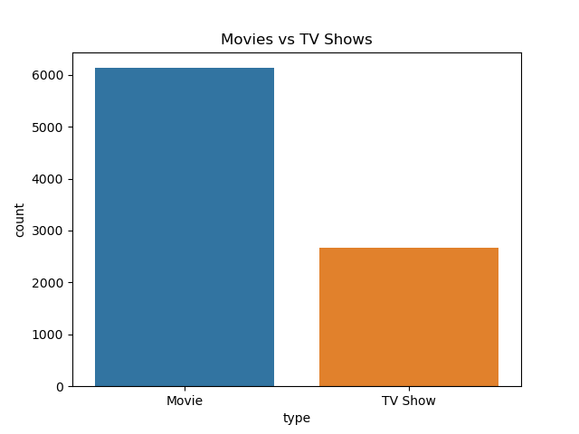
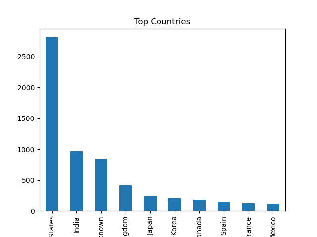
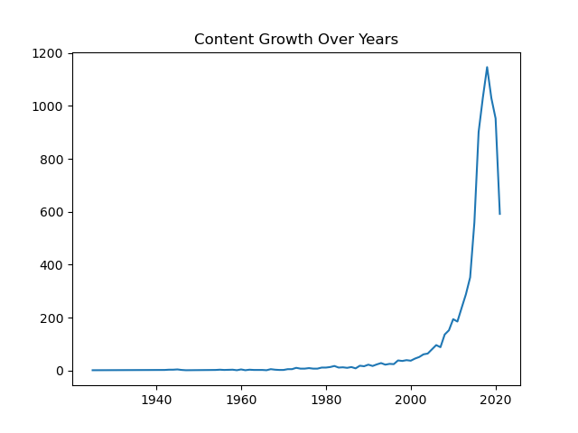
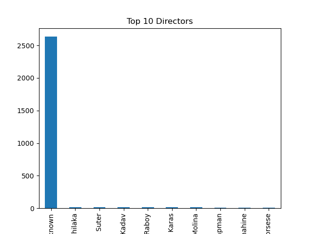
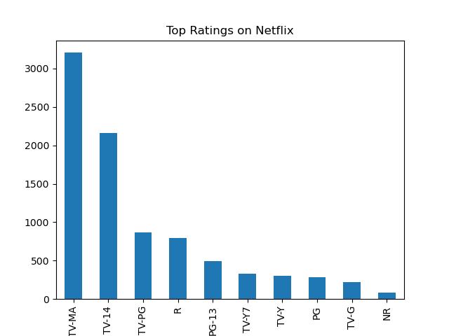
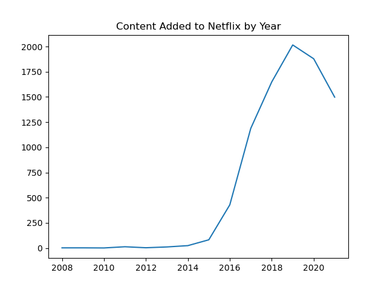

# Netflix Data Analysis

## Project Overview

This project focuses on analyzing Netflix's content dataset using Python. The goal was to explore the data, identify content trends, and gain meaningful insights through data cleaning, analysis, and visualization.

By working on this project, I improved my understanding of Exploratory Data Analysis (EDA), data visualization, and extracting business insights from real-world datasets.

---

## Tools & Technologies Used

* Python
* Pandas
* NumPy
* Matplotlib
* Seaborn
* Jupyter Notebook

---

## Dataset Information

The dataset contains information about Netflix Movies and TV Shows, including:

* Title
* Content Type (Movie / TV Show)
* Director
* Cast
* Country
* Release Year
* Rating
* Date Added
* Duration

---

## Analysis Performed

### 1. Movies vs TV Shows

Compared the distribution of Movies and TV Shows available on Netflix.

### 2. Top Content Producing Countries

Analyzed which countries contribute the highest amount of content to Netflix.

### 3. Content Growth Over Time

Studied how Netflix expanded its content library over the years.

### 4. Top Directors

Identified directors with the highest number of titles on Netflix.

### 5. Content Ratings Analysis

Explored the most common audience ratings available on the platform.

### 6. Content Added Per Year

Analyzed the trend of content additions and Netflix's growth over time.

---

## Visualizations Included

* Movies vs TV Shows
* Top Countries by Content Count
* Content Growth Over Years
* Top Directors
* Top Ratings
* Content Added Per Year

---

## Sample Outputs

### Movies vs TV Shows



**Observation:**  
Netflix has significantly more Movies than TV Shows. Movies account for the majority of the platform's content library.

---

### Top Content Producing Countries



**Observation:**  
The United States contributes the highest amount of content on Netflix. India ranks second and is one of Netflix's major content-producing countries.

---

### Content Growth Over Years



**Observation:**  
Netflix's content library expanded rapidly after 2010, with the highest growth observed around 2018–2019.

---

### Top Directors



**Observation:**  
Many records contain missing director information. Among the available data, a small number of directors have contributed multiple titles to Netflix.

---

### Top Ratings



**Observation:**  
TV-MA is the most common rating on Netflix, indicating a large amount of mature-audience content on the platform.

---

### Content Added Per Year



**Observation:**  
Netflix significantly increased content additions after 2016. Content additions reached their peak around 2019 before slightly declining in later years.

```

## Key Insights

* Movies significantly outnumber TV Shows on Netflix.
* The United States contributes the highest amount of content.
* India is among the leading content-producing countries.
* Netflix experienced rapid growth in content additions after 2016.
* Content additions reached their peak around 2019.
* TV-MA is the most common content rating on the platform.
* Netflix has expanded globally by increasing international content.

---

## Project Structure

```text
Netflix-Project/
│
├── data/
│   └── netflix_titles.csv
│
├── notebook/
│   └── netflix_analysis.ipynb
│
├── output/
│   ├── movies_vs_tvshows.png
│   ├── top_countries.png
│   ├── content_growth.png
│   ├── top_directors.png
│   ├── top_ratings.png
│   └── content_added_year.png
│
└── README.md
```

---

## How to Run This Project

1. Download or clone the repository.
2. Install the required libraries:

```bash
pip install pandas numpy matplotlib seaborn
```

3. Open Jupyter Notebook.
4. Run the notebook file `netflix_analysis.ipynb`.

---

## Conclusion

This project helped me understand how data analysis can be used to uncover trends and patterns from large datasets. Through visualization and exploration, I was able to gain insights into Netflix's content distribution, growth, ratings, and global presence.

The project also strengthened my practical skills in Python, Pandas, data cleaning, and data visualization.

---

## About Me

**Shabila Maaz**

B.Tech (Computer Science Engineering)

Aspiring Data Analyst with skills in:

* Excel
* SQL
* Python
* Power BI

This project is part of my Data Analytics portfolio.
